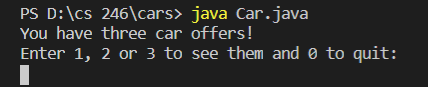

## Overview
This program will display different car classes, this is to show my ability to use classes and loops.

### Enviorment:
I used visual studio code with java and git downloaded

##### Running the Program:
I simpy inputed "Car.java" into the terminal and it displaye the results.

##### Screenshot:

##### Helpful Websites: 
I found w3school.com to be extremely helpful, escpecially their pages on formatting.
https://mkyong.com/java/how-to-format-a-double-in-java/